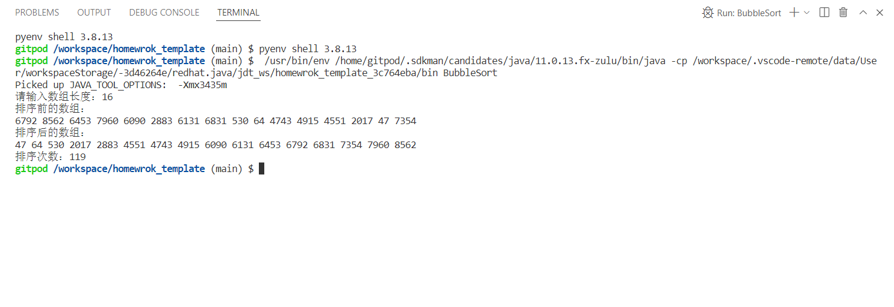
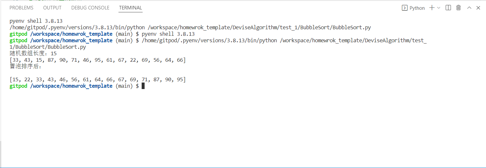
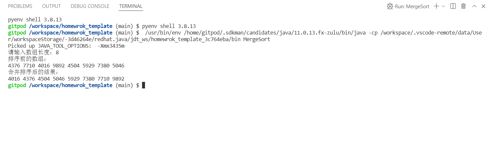
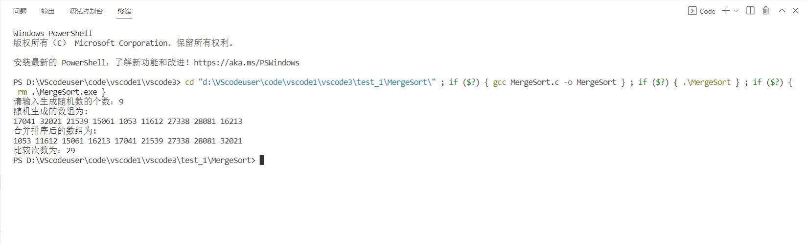
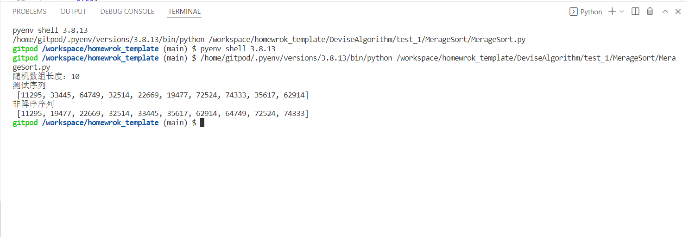
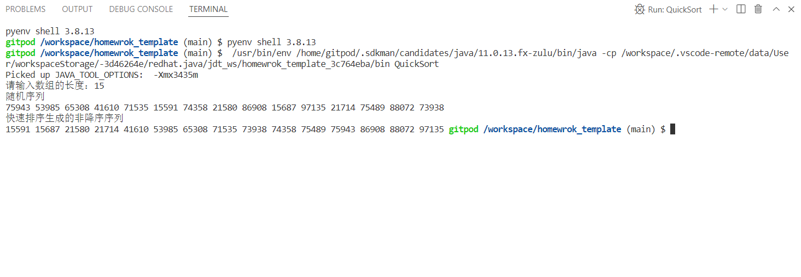
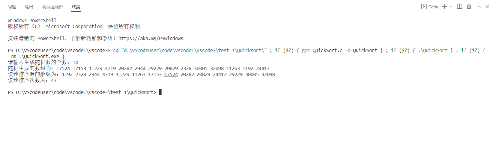
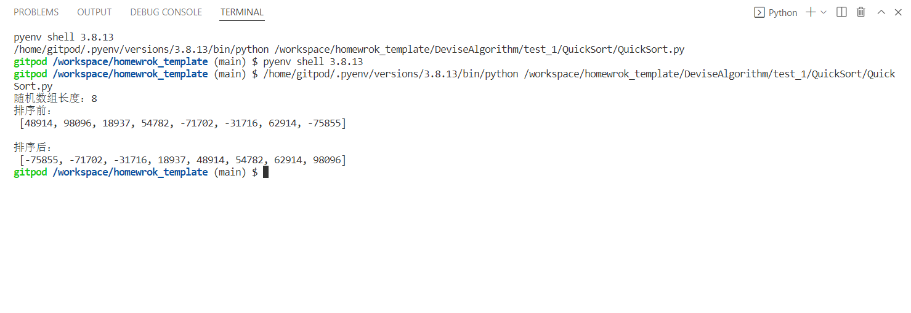
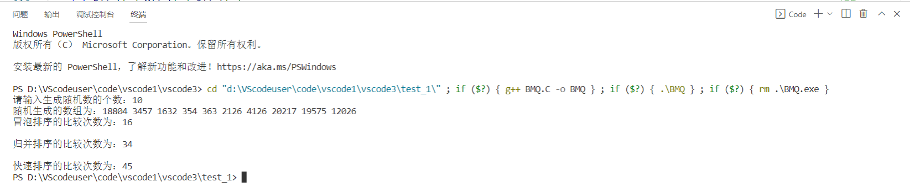

# 实验一、分治算法实验报告

## 学号：20201050470

>注:为保护同学隐私，请不要填写姓名

## 实验目的：
  通过排序算法的程序实现和执行时间测试，与理论上的结论进行对比分析，
深入理解算法时间复杂度渐进性态和和增长率的概念；理解分治算法设计的基本
思想、递归程序实现的基本方法，加深对分治算法设计与分析思想的理解。
## 实验原理
算法时间复杂度分析的相关概念
 (1) 算法的计算时间取决于算法中某些操作的执行次数，这些操作是算法时
间复杂度分析的依据。增长率反映了算法的计算时间复杂度，即随着算法输入规
模的增加、算法计算时间增加的趋势。算法的计算时间复杂度针对输入数据的等
价类来分析或测试。
(2)随机数生成算法
通过程序生成（伪）随机数，作为实验用测试数据。可使用编程语言自带的random 函数生成，也可以采用一些有效的随机数生成算法生成，
例如“线性同余法”，基于该算法，只要参数选择合适，所产生的伪随机数就能满足均匀性和独立性，与真正的随机数具有相近的性质。该算法的基本思想如下：
通过设置 Xi+1=(aXi+c) mod m, n?0，其中的 4 个整数参数：m——模数, m>0； a——乘数, 0?a<m；c——增量, 0<c<m；X0——开始值, 0<X0<m。这样得到所求
的随机数序列{Xi}，称作线形同余序列。
(3)分治算法
分治算法的基本思想是将一个规模为 n 的问题分解为 k 个规模较小的子问
题，这些子问题相互独立且与原问题性质相同。求出子问题的解，就可得到原问
题的解。分治算法设计的一般步骤包括：
(1) 分解，将要解决的问题划分成若干规模较小的同类问题；
(2) 求解，当子问题划分得足够小时，用较简单的方法解决；
(3) 合并，按原问题的要求，将子问题的解逐层合并构成原问题的解。
## 实验输入数据集
-------------------------------
>BubbleSort
1.[C]测试数据：[13641 16818 4393 32671 11485 19886 31309 27951 30847 25 11351 24428]
2.[Java]测试数据：[6792 8562 6453 7960 6090 2883 6131 6831 530 64 4743 4915 4551 2017 47 7354 ]
3.[Python]测试数据：[33 ,43 ,15,87,90,71,46,95,61,67,56,64,66]
-------------------------------
>MerageSort
1.[C]测试数据：[17041 32021 21539 15061 1053 11612 27338 28081 16213 ]
2.[Java]测试数据：[4376 7710 4016 9892 4504 5929 7380 5046 ]
3.[Python]测试数据：[11295, 33445, 64749, 32514, 22669, 19477, 72524, 74333, 35617, 62914]
--------------------------------
>QuickSort
1.[C]测试数据：[17524 17153 11229 4719 20282 2944 29229 20829 2328 30005 32098 11263 1192 24417]
2.[Java]测试数据：[75943 53985 65308 41610 71535 15591 74358 21580 86908 15687 97135 21714 75489 88072 73938 ]
3.[Python]测试数据：[48914, 98096, 18937, 54782, -71702, -31716, 62914, -75855]
----------------------------------
>BMQ
[C]测试数据：
1. 10个
2. 100个
3. 1000个
4. 2000个
5. 5000个
6. 10000个
7. ...
--------------------------------------
文件数据集：[数据集](./data_1/list.txt)

## 实验内容

### BubbleSort算法
1. [BubbleSort.py](./Bubblesort/Bubblesort.py) 算法实现的python版本
2. [BubbleSort.c](./Bubblesort/Bubblesort.c) 算法实现的C语言版本
3. [BubbleSort.java](./Bubblesort/Bubblesort.java) 算法实现的java版本
#### MerSort算法

>1.[MerSort.py](./MergeSort/MergeSort.c)算法实现的python版本
>2.[MerSort.c](./MergeSort/MergeSort.py)算法实现的C语言版本
>3.[MerSort.java](./MergeSort/MergeSort.java)算法实现的java版本

### QuickSort算法
>1.[Quicksort.py](./Quicksort/QuickSort.py)算法实现的python版本
>2.[QuickSort.c](./Quicksort/QuickSort.c)算法实现的C语言版本
>3.[QuickSort.java](./Quicksort/QuickSort.java)算法实现的java版本

### 实验数据相同的次数比较程序BMQ
[BMQ.c](./BMQ.C)算法实现的C语言版本

---------------------------------------------------------------------------------------------------------------------
## 实验预期结果与实际结果
----------------------------------------------------------------------------------------------------------------------
### BubbleSort算法
----------------------------------------------------------------------------------------------------------------------
+ 实验预期结果：
>[C]: [25 4393 11351 11485 13641 16818 19886 24428 27951 30847 31309 32671] 
>[java]:  [47 64 530 2017 2883 4551 4743 4915 6090 6131 6453 6792 6831 7354 7960 8562 ]      
>[Python]:[15, 22, 33, 43, 46, 56, 61, 64, 66, 67, 69, 71, 87, 90, 95]
---------------------------------------------------------------------------------------------------------------------
实验过程及实验结果（Java版）

--------------------------------------------------------------------------------------------------------------------
实验过程及实验结果（C版）

--------------------------------------------------------------------------------------------------------------------
实验过程及实验结果（Python版）

---------------------------------------------------------------------------------------------------------------------

### MerSort算法
-------------------------------------------------------------------------------------------------------------------
+ 实验预期结果：
>[C]:[1053 11612 15061 16213 17041 21539 27338 28081 32021 ]
>[java]:[4016 4376 4504 5046 5929 7380 7710 9892 ]
>[Python]:[11295, 19477, 22669, 32514, 33445, 35617, 62914, 64749, 72524, 74333]

-------------------------------------------------------------------------------------------------------------------
实验过程及实验结果（Java版）

--------------------------------------------------------------------------------------------------------------

实验过程及实验结果（C版）

-------------------------------------------------------------------------------------------------------------

实验过程及实验结果（Python版）

------------------------------------------------------------------------------------------------------------

### QuickSort算法
---------------------------------------------------------------------------------------------
+ 实验预期结果：
>[C]:[1192 2328 2944 4719 11229 11263 17153 17524 20282 20829 24417 29229 30005 32098 ]
>[java]:[15591 15687 21580 21714 41610 53985 65308 71535 73938 74358 75489 75943 86908 88072 97135]
>[Python]:[-75855, -71702, -31716, 18937, 48914, 54782, 62914, 98096]

实验过程及实验结果（Java版）

--------------------------------------------------------------------------------------------------------------

实验过程及实验结果（C版）

-------------------------------------------------------------------------------------------------------------

实验过程及实验结果（Python版）

------------------------------------------------------------------------------------------------------------

# 实验数据相同的次数比较程序BMQ
+ 实验预期结果：
>[C]:

实验过程及实验结果（C版）

