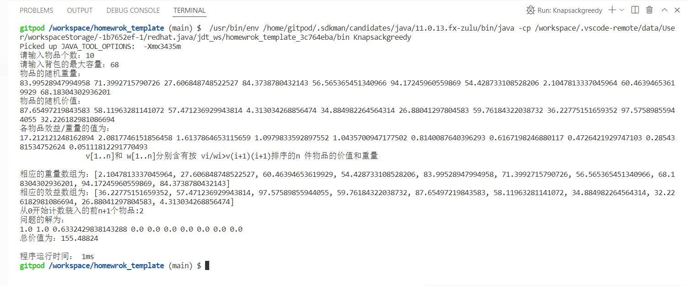
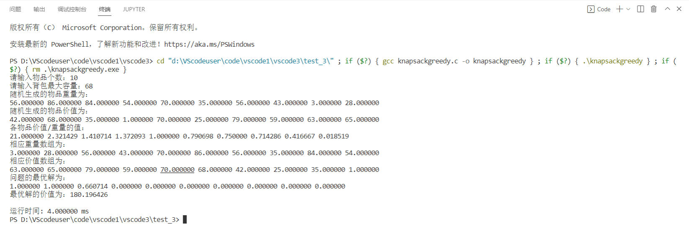
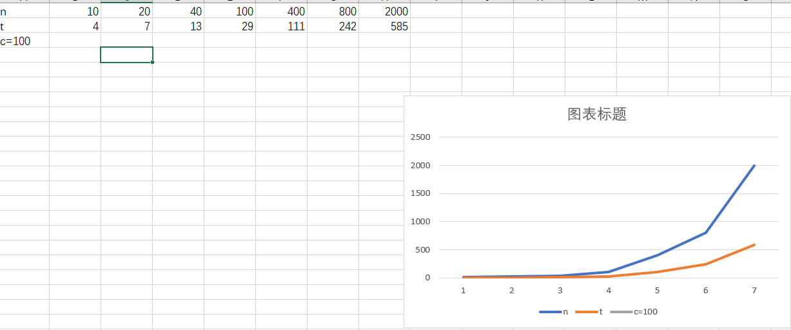

# 实验三、贪心算法实验报告

## 学号：20201050470

## 实验目的：

1. 编程实现经典的贪心算法，理解贪心算法设计的基本思想、程序实现的相关
技巧，加深对贪心算法设计与分析思想的理解。通过程序的执行时间测试结果，
与理论上的时间复杂度结论进行对比、分析和验证。

## 实验原理
贪心算法的基本思想
贪心算法求解优化问题的基本思想是：采用逐步构造最优解的方法。在每个
阶段，都作出一个当前最优的决策（在一定的标准下）。决策一旦作出，就不可
再更改（作出贪心决策的依据称为贪心准则）。贪心算法的一般步骤如下：
(1) 根据拟解决问题选取一种贪心准则；
(2) 按贪心准侧标准对 n 个候选输入排序（以这一方法为代表，仍可基于堆
来存储候选）。

## 实验输入数据集

文本数据集： 
文件数据集：[数据集](.list.txt)

## 实验内容

1. [knapsackgreedy.py](./knapsackgreedy.py) 算法实现的python版本
2. [knapsackgreedy.c](./knapsackgreedy.c) 算法实现的C语言版本

## 实验预期结果与实际结果
+ 实验预期结果：14

实验过程及实验结果（Java版）
1. 

实验过程及实验结果（C版）
2. 

分析结果：
